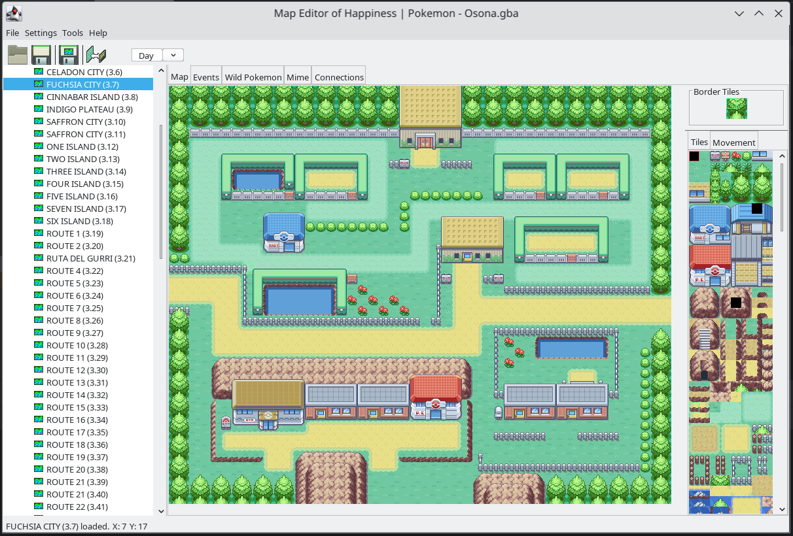

# Map Editor of Happiness (MEH)

MEH is a Generation III Map Editor for Pokemon Fire Red, Leaf Green, Ruby, Sapphire, and Emerald 
games for the GameBoy Advance.

MEH is a Generation III Map Editor for Pokemon games for the GameBoy Advance:
- Fire Red
- Leaf Green
- Ruby
- Sapphire
- Emerald

## About

This is a fork from a [project](https://github.com/shinyquagsire23/MEH) developed a while ago by other people. My goal
is to update it and continue it's develop as far as I can.

**Improvements:**

I added GBAUtils and dsdecmp dependencies locally and ini4j dependency (to it's lastest version from 2015) externally 
with a maven repository at it's lastest version, allowing java to been upgrade from 1.6 to 21.

**Dependencies:**

- [GBAUtils](https://github.com/shinyquagsire23/GBAUtils)